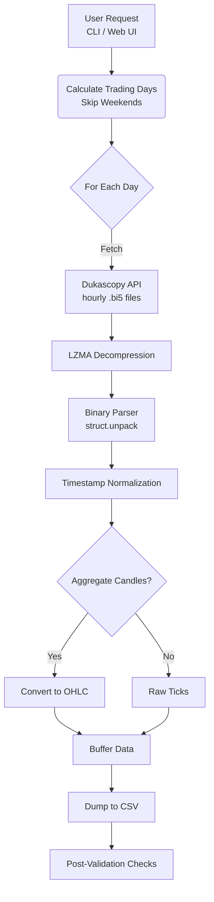

<div align="center">

# 🌟 Dukascopy Historical Data Downloader

**The Most Advanced, Production-Ready Tool for Downloading Historical Forex & CFD Data.**

[](https://python.org)
[](https://fastapi.tiangolo.com)
[](#)
[](#)
[](LICENSE)

<p align="center">
  <b>🔥 Dual Interface</b> • <b>⚡ Lightning Fast</b> • <b>🛡️ Anti-Rate-Limiting</b> • <b>📦 Resumable Downloads</b> • <b>✨ Millisecond Precision</b>
</p>


<p align="center">
  <a href="#-quick-start">Quick Start</a> •
  <a href="#-installation">Install</a> •
  <a href="#-features">Features</a> •
  <a href="#-documentation">Docs</a> •
  <a href="#-troubleshooting">Troubleshooting</a>
</p>

</div>

---

## 📖 Overview

**Dukascopy Historical Data Downloader** is an enterprise-grade Python application designed to reliably acquire high-quality historical tick and OHLC candle data from Dukascopy Bank's free datafeed. 

### The Problem
Dukascopy Bank provides excellent free forex data, but retrieving it at scale is notoriously difficult due to strict rate limiting (HTTP 503s), complex proprietary binary formats (.bi5), timezone shifts, and the high risk of interrupted downloads on large datasets.

### Our Solution
We handle the complexity for you. This tool features a smart backoff algorithm, native binary parsing, millisecond precision handling, and a state-saving resume feature, all wrapped in a dual Web UI and CLI architecture.

---

## ✨ Features

| Capability | Description | Status |
|:---|:---|:---:|
| 🌐 **Dual Interface** | Modern responsive Web UI + scriptable CLI | ✅ |
| 🛡️ **Anti-Rate-Limiting** | Smart exponential backoff and request jitter to avoid 503 errors | ✅ |
| 🔄 **Resumable Downloads** | State is saved every 5 days; never lose progress on a crash | ✅ |
| 🕯️ **Native & Custom Candles**| Direct M1/H1/D1 native support or tick-derived custom timeframes | ✅ |
| ⚡ **Lightning Fast** | Optimized LZMA decompression and binary struct parsing | ✅ |

<details>
<summary><b>🔍 View Detailed Feature Breakdown</b></summary>

* **Precision Options:** BID, ASK, MID pricing models.
* **Volume Flexibility:** TOTAL, BID, ASK, or TICKS volume types.
* **Custom Symbols:** Add any symbol seamlessly (e.g., BTCUSD, ETHUSD).
* **Real-time Logs:** WebSocket-powered streaming terminal via the Web UI.
* **Data Validation:** Post-download integrity checks ensure chronological order and detect gaps.
</details>

---

## 🚀 Quick Start

Get to your first dataset in under 60 seconds.

### 1. Prerequisites
- **Python** $\ge$ 3.8
- **Git**

### 2. Installation

```bash
# Clone the repository
git clone [https://github.com/Praveens1234/dukascopy-downloader.git](https://github.com/Praveens1234/dukascopy-downloader.git)
cd dukascopy-downloader

# Install dependencies
pip install -r requirements.txt
```

### 3. Launch

Choose your preferred interface:

#### Option A: Web Interface (Recommended)
```bash
python server.py
```
*Navigates to `http://localhost:8000` automatically. Best for visual monitoring and easy configuration.*

#### Option B: CLI (For Automation)
```bash
python cli.py EURUSD -s 2024-01-01 -e 2024-01-31 -t M1
```
*Downloads 1-minute EURUSD candles for Jan 2024. Best for cron jobs and scripts.*

---

## 📚 Documentation

### 💻 CLI Reference

The CLI is heavily optimized for batch processing and headless environments.

**Syntax:**
```bash
python cli.py SYMBOLS -s START_DATE -e END_DATE [OPTIONS]
```

<details>
<summary><b>View Common CLI Commands</b></summary>

```bash
# Download raw tick data (highest precision)
python cli.py EURUSD -s 2024-01-01 -e 2024-01-02 -t TICK

# Download multiple symbols simultaneously
python cli.py EURUSD GBPUSD XAUUSD -s 2024-01-01 -e 2024-06-01 -t H1

# Resume an interrupted download
python cli.py EURUSD -s 2020-01-01 -e 2024-12-31 --resume

# Generate custom 2-hour candles
python cli.py EURUSD -s 2024-01-01 -e 2024-06-01 -t CUSTOM --custom-tf 2h
```
</details>

### 🔌 REST & WebSocket API

Integrate the downloader into your own dashboards or trading infrastructure. 

<details>
<summary><b>View API Endpoints</b></summary>

| Method | Endpoint | Description |
|:---|:---|:---|
| `GET` | `/api/config` | Retrieve available symbols, timeframes, and limits |
| `POST` | `/api/download` | Trigger a new background download job |
| `GET` | `/api/jobs/{id}` | Get status and logs for a specific job |
| `WS` | `/ws` | Subscribe to real-time progress and logging |

**Example API Request:**
```bash
curl -X POST http://localhost:8000/api/download \
  -H "Content-Type: application/json" \
  -d '{"symbols": ["EURUSD"], "start_date": "2024-01-01", "end_date": "2024-01-31", "timeframe": "M1"}'
```
</details>

### 📊 Output Data Formats

Files are exported as clean, UTC-normalized CSVs. 
*Format:* `{SYMBOL}-{START_DATE}-{END_DATE}.csv`

**Example Tick Output (`TICK`):**
```csv
time,ask,bid,ask_volume,bid_volume
01.01.2024 00:00:00.123,1.10425,1.10420,150,200
01.01.2024 00:00:00.456,1.10430,1.10425,100,150
```

**Example Candle Output (`M1`, `H1`, `D1`):**
```csv
time,open,high,low,close,volume
01.01.2024 00:00:00,1.10420,1.10435,1.10415,1.10430,1250.5
01.01.2024 00:01:00,1.10430,1.10445,1.10425,1.10440,980.25
```

---

## 🏗️ Architecture & Data Flow



<details>
<summary><b>View Binary Struct Details (.bi5)</b></summary>

**Tick Binary Format (20 bytes per tick):**
```python
# Unpacked via: struct.unpack('!IIIff', data)
# Offset 0-3:   Time offset (ms)
# Offset 4-7:   Ask price 
# Offset 8-11:  Bid price
# Offset 12-15: Ask volume
# Offset 16-19: Bid volume
```
</details>

---

## ❓ Troubleshooting

> [!TIP]
> **HTTP 503 Errors?** This is Dukascopy's rate limit. The tool has built-in exponential backoff. Do not cancel the script; just wait and it will succeed automatically.

<details>
<summary><b>Web Server Won't Start (Port 8000 in use)</b></summary>
The server will usually auto-try port 8001. If it doesn't, kill the existing process:

```bash
# Windows
netstat -ano | findstr :8000
taskkill /F /PID <PID>

# Linux/Mac
lsof -i :8000
kill -9 <PID>
```
</details>

<details>
<summary><b>Empty CSV Files</b></summary>
Ensure your date range doesn't fall exclusively on a weekend (Saturdays/Sundays are skipped as markets are closed). Also verify the symbol is typed correctly.
</details>

<details>
<summary><b>Downloads Are Too Slow</b></summary>
This is intentional to prevent IP bans. If you have a highly stable connection, you can increase threads cautiously:
<code>python cli.py EURUSD -s 2024-01-01 -e 2024-12-31 -t M1 --threads 10</code>
</details>

---

## 🤝 Contributing

Contributions from the quantitative trading and algorithmic finance community are highly encouraged! 

1. **Fork** the repository.
2. **Clone** your fork (`git clone https://github.com/YOUR_USERNAME/dukascopy-downloader.git`)
3. **Branch** (`git checkout -b feature/amazing-feature`)
4. **Commit** (`git commit -m 'feat: Add amazing feature'`)
5. **Push** (`git push origin feature/amazing-feature`)
6. Open a **Pull Request**.

Ensure you run tests before submitting:
```bash
python tests/test_e2e_api.py
```

---

## ⚖️ Legal & Acknowledgments

### Disclaimer
> [!WARNING]
> This tool is for **educational and research purposes only**. Dukascopy's data is provided for **personal use**. Please respect their Terms of Service and rate limits. The authors are **not affiliated** with Dukascopy Bank SA.

### Acknowledgments
* [duka](https://github.com/giuse88/duka) - Original inspiration for binary parsing.
* [Dukascopy Bank SA](https://www.dukascopy.com) - For providing free historical data access to the community.

### License
This project is licensed under the MIT License - see the [LICENSE](LICENSE) file for details.

---

<div align="center">
  
  
  ### 🌟 Made with ❤️ for the Quantitative Trading & Algorithmic Finance Community 🌟
  **If this project helped you save time, consider giving it a ⭐ star!**
</div>
